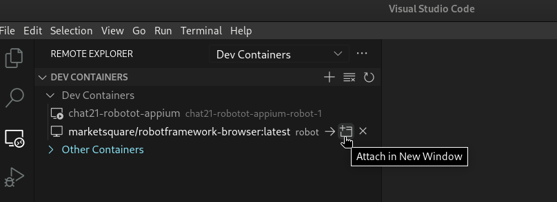

# Automated Mobile Testing with Robot Framework and Appium in Docker

This guide demonstrates how to set up a Dockerized environment for automating mobile app tests using Robot Framework and Appium. This approach streamlines test execution, ensures environment consistency, and eliminates the need for local tool installations.


## Automation Environment

- Appium Server container
- Robot Framework container
- Physical Mobile device
- Appium Inspector
- (optional) Scrcpy
- (optional) Visual Code with Dev Containers Extension

### Setting up the Environment

#### Prerequisites
- Ensure Docker is installed and configured
- Ensure ADB is installed
- Device with developer mode active and USB Debugging enabled

**Optional**
- Enable device's Wireless Debugging
- Install Scrcpy

#### Steps
1. Open the terminal and navigate to your project directory
    ```bash
    cd path/to/project
    ```
1. Connect the device via USB to your computer
    
    Approve the connection on your device
1. (optional) Mirror the mobile device screen
    ```bash
    # Check if device is connected (attached)
    adb devices
    # Restart the adb server in tcpip mode on port 5555
    adb tcpip 5555
    # Mirror the device via wifi (enter the ip of your device)
    scrcpy --tcpip=192.168.15.59:5555
    ```
1. Run appium server container and Robot container
    ```bash
    # (First time) Build services
    docker compose build
    docker compose up -d
    # outputs
        # [+] Running 2/2
        # ✔ Container appium  Started 
        # ✔ Container robot   Started   
    ```
1. Check if the device is connected to the Appium Server
    ```shell
    # Executes "adb devices" commando inside appium docker
    docker exec appium adb devices
    ```
    Or if you follow step 6: 
    ```shell
    # Kill adb server on your machine to disconnect the device
    adb kill-server
    # Check if the device is connected to the appium server
    docker exec appium adb devices
    # Mirror the device screen
    scrcpy --tcpip=192.168.15.59:5555
    ```
1. (Optional) Attach VS Code to the Robot container
    With the Dev Container extension, you can open any folder or repository inside a Docker container and take advantage of Visual Studio Code's full feature set.
    
    
1. Eventually you will ned to stop containers
    ```shell
    docker compose down
    ```


## Tips for programming tests

### Containers Host

Within the docker network, you can use the name of the container as an alias for the IP address. 

```python
Open Application    
...    remote_url=http://appium:4723
...    platformName=Android
...    automationName=UiAutomator2
```

Outside the docker network, you must provide the IP address. This is how you can identifying the IP address assigned to a container

```bash
docker inspect appium | grep IPAddress 
# Result
#    "SecondaryIPAddresses": null,
#    "IPAddress": "",
#        "IPAddress": "172.23.0.3",

```
### How to configure Appium Inspector

1. Install Appium Inspector, or, access the web version
    

1. Fill in the following data:
    - **Remote Host**: The IP address of the Appium container
    - **Remote Port**: 4723
    - Capacility Builder
        - **platformName: Android**
        - **automationName: UiAutomator2**
1. Click the *Start Session* button
1. The inspection interface should be loaded
    

### You don't need a thirdy party app to retrieve the target app package name
Eventually, you will need the package name of the tested app, you can achieve this using following commands:

```shell
# Enter the Appium container.
docker exec -it appium bash
# Connect to the Android device shell.
adb shell
# Get the package name of the app in focus.
dumpsys window | grep mCurrentFocus
```

## Observations

This is a basic example. Customize it for your specific testing requirements.

## Resources 

Check these links for more information
* **ADB** [official documentation](https://developer.android.com/tools/adb)
* **Appium** [official documentation](https://appium.io/)
* **Appium Docker Image** [github repository](https://github.com/appium/appium-docker-android)
* **Appium Inspector** [github repository](https://github.com/appium/appium-inspector)
* **Docker** installation [official documentation](https://docs.docker.com/engine/install/)
* **Robot Framework** [official documentation](https://robotframework.org/)
* **Robot Docker Image** [github repository](https://github.com/MarketSquare/robotframework-browser/tree/main/docker)
* **Scrcpy** [github repository](https://github.com/Genymobile/scrcpy)
